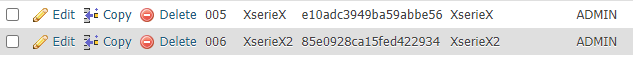

Hash
===================

 **Hash** คือ ฟังก์ชันที่มีบทบาทอย่างมากในการสร้างระบบความปลอดภัยเนื่องจากสามารถแปลงข้อมูลปกติ
 ที่กำหนดให้เป็นค่าความยาวคงที่ผิดปกติและอ่านก็ไม่มีทางเข้าใจเลย เราสามารถจินตนาการได้ว่าเป็นเครื่องปั่นในบ้านของเรานั้น  
 เมื่อเราใส่ข้อมูลลงในฟังก์ชั่นนี้มันจะส่งออกค่าที่ไม่ปกติหรือไร้ความหมาย ค่าเหล่านี้เรียกว่า"ค่าแฮช(Hash Value)"
 ค่าแฮชเป็นเพียงตัวเลข แต่มักเขียนเป็นเลขฐานสิบหก คอมพิวเตอร์จัดการค่าเป็นแบบไบนารี ค่าแฮชยังเป็นข้อมูลและมักถูกจัดการใน 

 **รูปแบบการใช้งาน**

    hash ( string $algo , string $data , bool $binary = false ) : string|false

***ตัวอย่างการนำไปใช้ในการเข้ารหัส*** 

    <?php
        $pass = $_POST["txtPassword"];
        $enc = hash("MD5",$pass);
    ?>

    โดยเราจะลองใส่ 123456

***ผลลัพธ์***

    e10adc3949ba59abbe56

***ตัวอย่างการนำไปใช้ในการเข้ารหัส 2***

    <?php
        echo hash("MD5","XserieX");
    ?>

***ผลลัพธ์***

    85e0928ca15fed422934

***รูปผลลัพธ์***

    

ฟังก์ชั่นแฮชโดยทั่วไปจะทำการคำนวณบางอย่างในคอมพิวเตอร์ค่าข้อมูลที่ส่งออกมีความยาวคงที่
ความยาวจะแตกต่างกันไปตามฟังก์ชั่นแฮช ค่าไม่แตกต่างกันแม้ว่าจะมีค่ามากหรือน้อยก็ตาม  

คุณสมบัติของฟังก์ชันแฮช(Hash function)
- ข้อมูลแต่ละตัวเมื่อผ่านฟังก์ชันแฮชแล้วจะต้องมีค่าไม่เท่ากัน มีลักษณะที่จำเพาะแต่ล่ะข้อมูล
- หาค่าแฮชจากข้อมูลควรทำได้ง่ายและรวดเร็ว
- เมื่อข้อมูลผ่านฟังก์ชันแฮชแล้วไม่ควรทำย้อนกลับได้
- การบวนการแฮชควรมีการกระจายตัวสูง ข้อมูลใดๆที่ผ่านฟังก์ชันแฮชควรมีขนาดเท่ากัน แต่ไม่เหมือนกัน

ทำไมต้องมีฟังก์ชันแฮช?
- เพื่อใช้ตรวจสอบว่าข้อมูลมีการเปลี่ยนแปลงหรือไม่
- เพื่อใช้เก็บข้อมูลสำหรับเปรียบเทียบ โดยการเปรียบเทียบข้อมูลจะทำได้รวดเร็วขึ้น
- ทำให้เป็นภาษาที่มนุษย์อ่านไม่เข้าใจ
- หากข้อมูลที่จะใช้เปรียบเทียบมีขนาดใหญ่มาก จะช่วยย่อข้อมูลให้เล็กลงได้มาก แต่ขึ้นอยู่กับวิธีของฟังก์ชันแฮช

ชนิดของฟังก์ชันแฮช
- MD2 (128bits) คิดค้นโดย Ronald Rivests
- MD4 (128bits) คิดค้นโดย Ronald Rivests
- MD5 (128bits) คิดค้นโดย Ronald Rivests
- MD6 (0~512 bits) คิดค้นโดย Ronald Rivests Team
- SHA0 (160bits) คิดค้นโดย National Security Agency : NSA
- SHA1 (160bits) คิดค้นโดย National Security Agency : NSA
- SHA2 (SHA-224, SHA-256, SHA-384, SHA-512) คิดค้นโดย National Security Agency : NSA

 การแปลงรหัสแฮชให้เป็นค่าดั้งเดิมนั้นแถบจะเป็นไปไม่ได้ นี่คือความแตกต่างหลักระหว่างการเข้ารหัสเป็นฟังก์ชันแฮช 
 ใน PHPมักใช้ฟังก์ชันแฮ็ชกับรหัสผ่าน เพื่อป้องกันไม่ให้คนอื่นอ่านออก แม้แต่ Admin เองก็ไม่สามารถรู้ได้

ปล.ถ้าจะถอดรหัสต้องใช้ ฟังก์ชัน แต่ละวิธีของฟังก์ชัน แต่ถ้าหากไม่รู้ว่าถูกเข้ารหัสด้วยอะไร
ก็คงอยากที่จะมาถอดรหัส เพราะยังมีอีกหลายฟังก์ชั่นในการเข้ารหัส เช่น แบบ MD5, hash , sha1

***อ้างอิง***
- <https://www.mindphp.com/developer/80-php-security/6993-hash-function.html>
- <https://www.php.net/manual/en/function.hash.php>