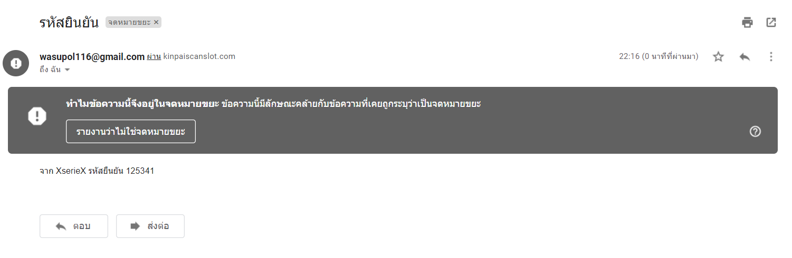

random_int
===================

 **random_int** คือ การสร้างจำนวนเต็มสุ่มแบบเข้ารหัสที่เหมาะสำหรับใช้ในกรณีที่ผลลัพธ์ที่เป็นกลางมีความสำคัญ

 **รูปแบบการใช้งาน**

    random_int ( int $min , int $max ): int

คืนค่า
ส่งคืนจำนวนเต็มสุ่มที่ปลอดภัยด้วยการเข้ารหัสลับในช่วง min และ max

***ตัวอย่างการนำไปใช้*** 

    <?php
        echo random_int(100, 999);
        echo random_int(-1000, 0);
    ?>

เมื่อเรียกใช้ไฟล์ html ด้านบนมันจะแสดงข้อความต่อไปนี้

***ผลลัพธ์***

    834
    -366

***ตัวอย่างการนำไปใช้ 2***

    <?php
        $random = random_int(100, 999);
        echo $random;
    ?>

สิ่งนี้จะให้ผลลัพธ์ดังต่อไปนี้

***ผลลัพธ์***

    382781

***ตัวอย่างการนำไปใช้ 3***

    <?php
        $random = random_int(100000, 999999);
        $strTo = "6317810014@mutacth.com";
        $strSubject = "รหัสยินยัน";
        $strHeader = "From: wasupol116@gmail.com";
        $strMessage = "จาก XserieX รหัสยืนยัน ".$random;
        $flgSend = @mail($strTo,$strSubject,$strMessage,$strHeader);
        if($flgSend)
        {
            echo "Email Sending.";
        }
        else
        {
            echo "Email Can Not Send.";
        }
    ?>

เมื่อเรียกใช้ไฟล์ ด้านบนมันจะส่งระหัสยืนยันไปที่ Email

***ผลลัพธ์***

***อ้างอิง***
- <https://www.php.net/manual/en/function.random-int.php>