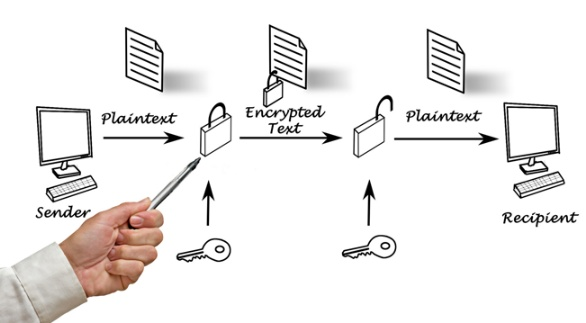

crypto.createCipheriv
===================

 **crypto.createCipheriv** คือ อินเตอร์เฟซการเขียนโปรแกรมประยุกต์ inbuilt 
 ของโมดูลการเข้ารหัสลับที่ใช้ในการสร้างวัตถุ Cipher กับที่ระบุขั้นตอนวิธีการที่สำคัญและเวกเตอร์เริ่มต้น
 
 AES encryption ใน Javascript เริ่มจากฝั่ง Browser ที่ต้องพึ่ง Crypto-JS เป็นชุด 
 Library สำหรับใช้ในการเข้ารหัสหรือทำ Hash ต่างๆ สิ่งที่เอามาใช้วันนี้คือ AES ที่เป็นการเข้ารหัส
 ที่ใช้กุญแจเหมือนกันทั้งสองฝั่ง

 **รูปแบบการใช้งาน**

    crypto.createCipheriv( algorithm, key, iv, options )

***ตัวอย่าง***

    
    

ถ้าเราใส่ “Secret Passphase” ไปตรงๆ สิ่งที่เกิดขึ้นคือมันจะ random IV (Initialization vector)
ให้อัตโนมัติแล้วเอาไปใช้คู่กับ passphase ที่ใส่เข้ามา ทำให้ passphase ไม่สามารถเอาไปใช้กับ Node.js crypto
ได้ ก็เลยต้องระบุเป็น Key และ IV ไป เราสามารถสร้าง Key และ IV ได้จาก OpenSSL ด้วยคำสั่งด้านล่าง

***ตัวอย่าง***

    <?php
        $openssl enc -aes-256-cbc -k password -nosalt -P
    ?>

***ผลลัพธ์***

    key=5F4DCC3B5AA765D61D8327DEB882CF992B95990A9151374ABD8FF8C5A7A0FE08
    iv =B7B4372CDFBCB3D16A2631B59B509E94

ค่าแต่ละค่าที่ใส่ใน argument ก็มีตั้งแต่
- -aes-256-cbc อันนี้เป็นวิธีที่เราจะใช้เข้ารหัส (ประกอบด้วย algorithm คือ aes, ความยาวของ key และ block cipher mode)
- -k ตามด้วย “Secret passphase” โดยอันนี้คือคำว่า “password”
- -nosalt เพื่อบอกว่าไม่ต้องการ random ข้อความเพิ่มเข้าไปเพื่อให้ key ยากขึ้นเข้าไปอีก (คือจะ random ก็ได้ไม่มีผลอะไรเพราะไม่ได้เอาไปใช้อยู่แล้ว)
- -P เพื่อให้แสดง key และ iv ออกมาแล้วจบการทำงาน

***ได้ key กับ iv เสร็จเอามาใช้ต่อตาม argument ที่เราใส่เข้าไป จะได้ออกมาเป็น***

    
    

แต่แค่ key และ iv ยังไม่พอสำหรับเอาไปใช้ใน Node.js ต้องระบุ Block cipher mode ด้วยพร้อม 
padding (Node.js 0.4.12 บน OSX ใช้ pkcs7) เพราะงั้น code ที่สมบูรณ์ก็จะได้ประมาณนี้

***ตัวอย่าง***

    
        

สิ่งที่ได้ออกมาจากการ encrypt จะถูกเข้ารหัสด้วย base64 อีกทีเพื่อเป็น String ส่งข้ามไปมาใช้ได้ง่ายๆ
คราวนี้มาดูฝั่ง Node.js บ้างเนื่องจากมี Crypto library อยู่แล้วแถมใช้ง่ายด้วย

***ตัวอย่าง***

    // ถ้าใช้ Node.js 0.6 ก็ใช้ new Buffer('code', 'hex').toString('binary'); ได้เลย
    var hexToBytes = function (hex) {
    var output = [];
    var buf = '';
      
    for (var index = 0; index < input.length; index++) {
        var c = hex.charAt(index);
        
        if (buf.length == 2) {
            output.push(parseInt(buf, 16));
        buf = '';
        } 
        
        buf += c;
    }
        
        output.push(parseInt(buf, 16));
        return output;
    } 
      
        var key = '5F4DCC3B5AA765D61D8327DEB882CF992B95990A9151374ABD8FF8C5A7A0FE08';
        var iv = 'B7B4372CDFBCB3D16A2631B59B509E94';
        var cipher = crypto.createCipheriv('aes256', new Buffer(hexToBytes(key)).toString('binary'), new Buffer(hexToBytes(iv)).toString('binary'));
        var crypted = cipher.update('Message', 'utf8', 'base64');
            crypted += cipher.final('base64');
      
        var decipher = crypto.createDecipheriv('aes256', new Buffer(hexToBytes(key)).toString('binary'), new Buffer(hexToBytes(iv)).toString('binary'));
        var plain = decipher.update(crypted, 'base64', 'utf8');
            plain += decipher.final('utf8');

จากนั้นจะส่งอะไรเข้ารหัสไว้ ข้ามไปมาระหว่าง Browser/Server ก็ไม่มีปัญหา

***อ้างอิง***
- <http://llun.github.io/blog-archive/llun.in.th/2011/12/crypto-js-node-js-crypto/index.html>