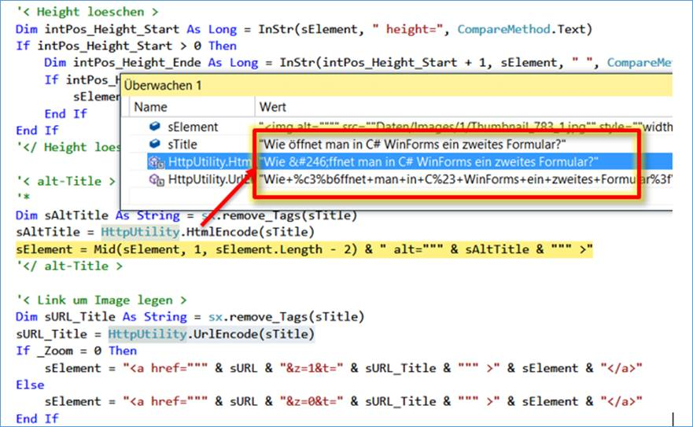

HttpUtility.HtmlEncode
===================

 **HttpUtility.HtmlEncode** คือ แปลงสตริงเป็นสตริงที่เข้ารหัส HTML
ในการเข้ารหัสหรือถอดรหัสค่าภายนอกเว็บแอ็พพลิเคชันให้ใช้คลาสWebUtility

 AES encryption ใน Javascript เริ่มจากฝั่ง Browser ที่ต้องพึ่ง Crypto-JS เป็นชุด 
 Library สำหรับใช้ในการเข้ารหัสหรือทำ Hash ต่างๆ สิ่งที่เอามาใช้วันนี้คือ AES ที่เป็นการเข้ารหัส
 ที่ใช้กุญแจเหมือนกันทั้งสองฝั่ง

 **รูปแบบการใช้งาน**

    public static string HtmlEncode (object value);

ตัวอย่างโค้ดต่อไปนี้แสดงให้เห็นถึงเมธอด HtmlEncodeและHtmlDecodeของคลาสHttpUtility 
สตริงอินพุตถูกเข้ารหัสโดยใช้เมธอดHtmlEncode จากนั้นสตริงที่เข้ารหัสที่ได้รับจะถูกถอดรหัสโดยใช้เมธอดHtmlDecode

***ตัวอย่าง***

    using System;
    using System.Web;
    using System.IO;
     
    class MyNewClass
    {
    public static void Main()
    {
        Console.WriteLine("Enter a string having '&', '<', '>' or '\"' in it: ");
        string myString = Console.ReadLine();
     
        // Encode the string.
        string myEncodedString = HttpUtility.HtmlEncode(myString);
     
        Console.WriteLine($"HTML Encoded string is: {myEncodedString}");
        StringWriter myWriter = new StringWriter();
     
        // Decode the encoded string.
        HttpUtility.HtmlDecode(myEncodedString, myWriter);
     
        string myDecodedString = myWriter.ToString();
        Console.Write($"Decoded string of the above encoded string is: {myDecodedString}");
        }
    }

หากมีการส่งอักขระเช่นช่องว่างและเครื่องหมายวรรคตอนในสตรีม HTTP อักขระเหล่านั้นอาจตีความผิดในตอนท้ายการรับ 
การเข้ารหัส HTML จะแปลงอักขระที่ไม่ได้รับอนุญาตใน HTML เป็นการเทียบเท่าอักขระ - เอนทิตี การถอดรหัส HTML 
จะย้อนกลับการเข้ารหัส ตัวอย่างเช่นเมื่อฝังอยู่ในบล็อกข้อความอักขระ <และ> จะถูกเข้ารหัสเป็น&lt;และ&gt;สำหรับการส่ง HTTP

**HtmlEncode(String, TextWriter)**

แปลงสตริงเป็นสตริงที่เข้ารหัส HTML และส่งกลับผลลัพธ์เป็นสตรีมเอาต์พุตของTextWriter

***ตัวอย่าง***

    public static void HtmlEncode (string? s, System.IO.TextWriter output);

***อ้างอิง***
- <https://docs.microsoft.com/en-us/dotnet/api/system.web.httputility.htmlencode?view=net-5.0>